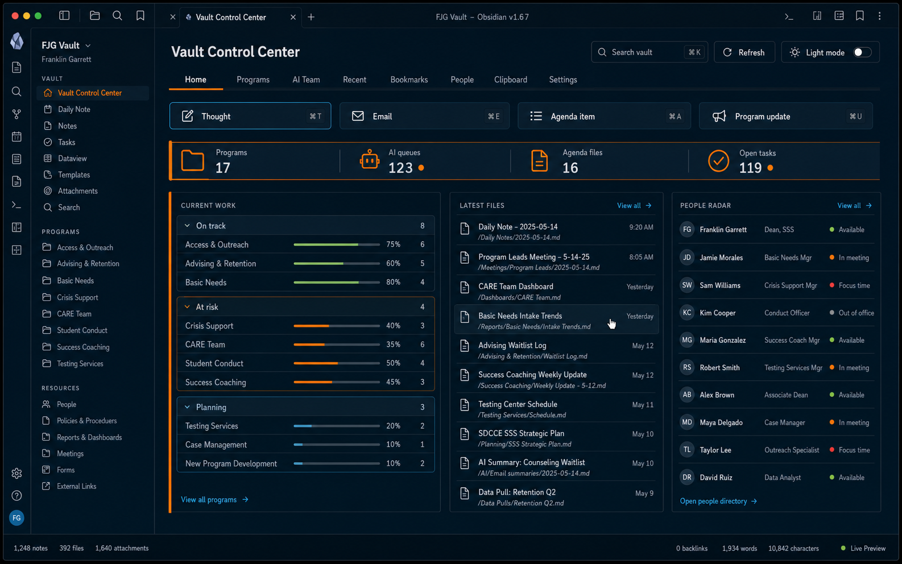

# Vault Control Center

Vault Control Center is a native Obsidian dashboard for operating a structured vault. It replaces a static HTML Viewer/local-server workflow with a live `ItemView`: files, folders, queues, bookmarks, people, tasks, capture actions, and templates all work through Obsidian itself.



> The image above is an illustrative design concept. The plugin renders your own live vault data.

## What it includes

The dashboard keeps nine views in one consistent throwback navy, gold, orange, royal-blue, and warm-cream interface:

| View | Purpose |
| --- | --- |
| Home | Capture actions, live signals, current programs, recent files, people, and task status |
| Areas | The complete safe folder tree, including empty folders, plus every supported file under the configured Areas source, with a collapsible root rail, recursive drill-down, breadcrumbs, and in-dashboard previews |
| Programs | Program folders, activity groups, a collapsible root rail, recursive subfolder drill-down, breadcrumbs, and in-dashboard previews |
| AI Team | Four configurable operational queues; Owner and Team inboxes use complete direct-file counts and lists |
| Recent | Searchable, vault-wide Obsidian file-open history with category filters |
| Bookmarks | Filtered Obsidian bookmarks; vault targets preview inside the dashboard and HTTP(S) links open externally |
| People | Agenda files, recency, and contact-list access |
| Clipboard | Editable, copyable, resettable templates |
| Settings | Theme, source health, privacy boundary, and native plugin settings |

Additional features:

- Native ribbon icon and command-palette actions
- Shared read-only preview pane across every file-bearing route; normal clicks keep the dashboard active
- Wider right-side desktop preview by default, with the Areas and Programs root rail independently retractable to give the folder detail and note more room
- Compact **Back**, **Open in tab**, and **Hide files** / **Show files** controls that remain accessible when labels collapse in constrained panes
- **Hide files** / **Show files** can still temporarily give the read-only note nearly the full dashboard width without changing the root-rail state
- Pane-safe Markdown wrapping plus responsive title/path controls so preview text remains visible at larger display scales
- Markdown, text/CSV/HTML source, JSON, image, audio, video, PDF, and Canvas-summary previews, with an explicit **Open in tab** action for native editing or unsupported formats
- Coordinated throwback dark and light themes derived from deep navy, golden yellow, orange, royal blue, and warm cream
- Optional Obsidian shell theming that is removed cleanly when disabled or unloaded
- Responsive layouts for desktop, split panes, tablets, and phones
- Live refresh after vault changes, with a manual force-refresh action
- Owner Inbox and Team Inbox treat direct safe, supported files as the active queue; nested subfolders are excluded, and queue lists are not truncated
- Recently viewed files start with Vault Control Center preview history, then use the enabled Recent Files plugin's file-open history when available and append Obsidian's native open history
- `/` to focus search while the dashboard is active, with the native search clear control
- In-memory indexing; only a capped list of safe preview paths is retained in Obsidian workspace state so Recent remains accurate

## Installation

### BRAT

1. Install and enable BRAT in Obsidian.
2. Choose **Add Beta plugin**.
3. Enter `jajuangarrett-ctrl/vault-control-center`.
4. Enable **Vault Control Center** in Community plugins.

### Manual

Download `main.js`, `manifest.json`, and `styles.css` from the latest release. Place them together in `<vault>/.obsidian/plugins/vault-control-center/`, then reload Obsidian and enable the plugin.

Vault Control Center requires Obsidian 1.12.7 or newer and is not desktop-only.

## First-run setup

Open **Settings → Community plugins → Vault Control Center** and configure the vault-relative paths for:

- Areas
- Programs
- People agendas and contacts
- Tasks
- Four operational queues
- Recent-activity fallback roots

The bundled defaults are generic examples. Missing sources are reported in the dashboard instead of causing the view to fail.

Recent combines three sources in viewed order: files previewed inside Vault Control Center, the optional Recent Files plugin when it is enabled in file-open mode, and Obsidian's native open history. Preview history is capped at 30 safe paths in the Obsidian workspace state; no file contents are stored. If none of these sources provides usable viewed-file history, the dashboard temporarily falls back to modified-time activity under the configured recent roots.

Capture buttons dispatch commands from companion capture plugins. Install and enable the corresponding Thought Capture, Email Capture, Agenda Capture, and Program Update Capture plugins for those buttons to work. Vault Control Center does not register the displayed actions as global hotkeys.

## Optional taskboard integration

Network access is disabled by default. If enabled, the taskboard panel makes a read-only `GET /api/tasks` request through Obsidian's `requestUrl` API and sends the selected credential in the `X-Dashboard-Password` header.

Two opt-in connection modes are available:

- A separate HTTPS endpoint with a credential selected from Obsidian Secret Storage
- Best-effort reuse of an enabled Task Capture plugin's existing connection

The separate connection takes precedence when both options are enabled. Secret values are read only in memory; Vault Control Center persists only the Secret Storage ID. Remote results are cached for five minutes during automatic vault refreshes, while the Refresh button and command force a new request.

## Privacy and external-access disclosure

Vault Control Center reads the vault-relative folders and files configured in its settings plus Obsidian's bookmarks configuration file. It does not access files outside the vault.

Before display, the index excludes hidden/internal folders, archived paths, and names that look like passwords, API keys, secrets, credentials, tokens, or private keys. Bookmark URLs containing basic-auth credentials or obvious sensitive query keys are withheld; visible URL metadata is reduced to the origin while the original URL is retained only for opening.

Path settings, interface preferences, and clipboard templates are stored in the plugin's local settings. Live file indexes, file contents, task records, and secret values are not saved there. Obsidian workspace state may contain the currently previewed safe path, a capped safe-path preview history, and the Areas/Programs root-rail disclosure state so the dashboard survives workspace restoration.

## Replacing the legacy launcher

The native plugin and an older HTML-launcher plugin can coexist during migration. Once the native dashboard is configured and verified, disable the legacy launcher to avoid two ribbon buttons with similar names. No HTML Viewer plugin or local web server is required by Vault Control Center.

## Development

```bash
npm ci
npm run check
```

`npm run check` runs the Vitest suite, strict TypeScript validation, and the production esbuild bundle.

## Troubleshooting

- **A source shows Missing:** confirm its vault-relative path in plugin settings, then use Refresh.
- **A capture action reports that it is not enabled:** install and enable the corresponding companion capture plugin.
- **The taskboard falls back to local counts:** confirm the HTTPS endpoint, select a valid Obsidian Secret Storage value, enable the separate connection, and force Refresh. The Task Capture adapter also requires that plugin to have a complete connection.
- **BRAT cannot install or update:** confirm the GitHub release includes `main.js`, `manifest.json`, and `styles.css` and that its tag matches the manifest version.
- **The old dashboard still opens:** disable the legacy launcher after confirming the native plugin is configured.
- **Recent does not match files you just viewed:** use Refresh. Files previewed in the dashboard are placed first, followed by Recent Files and native Obsidian history; configured recent roots are used only when no viewed history is available.
- **A file shows “Native preview required”:** use **Open in tab** for Office documents or formats without a safe embedded renderer.

## Design notes

The interface follows a reference-driven workflow: one stable information architecture, coordinated dark/light token sets, dense operational rows, and responsive behavior verified at both pane and viewport widths. See [the design system](docs/design/DESIGN.md) and [the fidelity ledger](tests/visual/FIDELITY.md).

## License

MIT © Franklin Garrett
